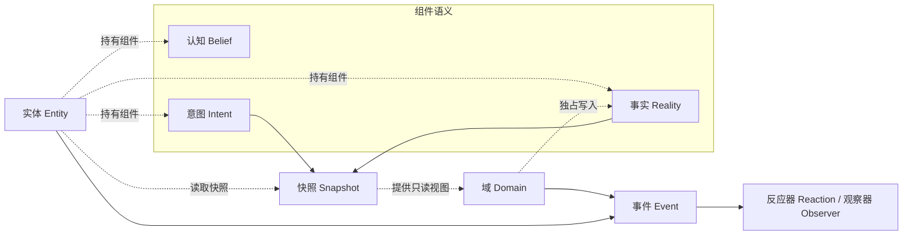

# 端 DUAN

端是一个面向仿真的域驱动框架，借鉴了 ECS 的部分数据组织思想。

**实体表达意图，域裁定事实。**

## 简介

很多仿真系统一开始只是把世界拆成一堆对象和字段，随着规则增加、参与者变多、时间推进变复杂，代码里很快会出现几个典型问题：谁都能改世界、同一份数据被多处解释、时序依赖越来越隐蔽、调试时很难说清楚“这一帧到底发生了什么”。

端围绕这些问题组织自己的结构。它同时关心数据放在哪里、数据代表什么、谁有资格更新它，以及变化应当如何被表达。实体承担行为主体的角色，域承担规则与演化的权威职责，事件用于描述已经发生的变化。这样一来，仿真在规模扩大后仍然能够保持清晰的职责边界和稳定的演化方式。

从工程上看，这种分工也有直接收益。世界写权集中在域中，可以减少不同模块同时改写同一份结果造成的混乱；通过快照读取同一时刻的世界，可以让实体和域基于一致视图工作，降低时序错误；按语义区分组件，则能让不同类型的数据采用不同的可见性和更新方式。再加上对 ECS 数据组织方式的借鉴，端既保留了批量处理与连续存储的效率基础，也避免把一切都压扁成无差别的数据块。

## 关系图

这张图表达的是端最核心的运行关系：认知、意图、事实都是组件语义，都会附着在实体上，但它们的可见性和写入权不同。实体维护认知、表达意图，也通过快照读取世界；域基于快照读取意图与事实，再独占写入事实，并在需要时发出事件。快照把“读取上一刻的世界”和“写入这一刻的结果”分开，这样更贴近实际的仿真过程，也更容易形成稳定的执行顺序。

## 三元语义

端把组件分成三类，用来明确不同数据在仿真中的职责。

`认知` 表示主体内部掌握的信息，它服务于主体自身的判断与行为，不要求对外公开。`意图` 表示主体对外表达的目标、打算或请求，它可以被世界规则读取，但并不直接等于最终结果。`事实` 表示当前时刻客观成立的世界内容，它同样以组件形式附着在实体上，但只能由域依据规则裁定，而不是由任意主体直接宣告。

这一区分的价值在于，系统可以更明确地表达“主体知道什么”“主体想做什么”“世界实际上成立什么”。一旦这三类语义被揉成同一种数据，仿真就很容易退化成多个模块对同一堆字段的竞争性改写；而在端里，它们在读取范围、写入权限和时序位置上天然不同。

## 术语

| 中文 | 英文 | 含义 |
| --- | --- | --- |
| 世界 | `World` | 仿真的整体容器，承载实体、域、事件、时间与存储。 |
| 实体 | `Entity` | 仿真中的行为主体。 |
| 组件 | `Component` | 附着在实体上的数据单元，按认知、意图、事实三种语义组织。 |
| 域 | `Domain` | 负责依据规则更新世界事实的单元。 |
| 认知 | `Belief` | 实体内部掌握的信息。 |
| 意图 | `Intent` | 实体对外表达的目标、打算或请求。 |
| 事实 | `Reality` | 当前时刻客观成立的世界内容。 |
| 事件 | `Event` | 已发生的一次变化。 |
| 反应器 | `Reaction` | 对事件作出处理，并允许继续影响世界的单元。 |
| 观察器 | `Observer` | 只读消费事件的单元。 |
| 快照 | `Snapshot` | 某一时刻世界的只读截面。 |

## 设计取向

端将仿真理解为一个由主体、规则与变化共同构成的过程。实体负责表达，域负责裁定事实，事件负责记录变化，快照负责提供一致视图。这样的结构便于解释系统，便于控制复杂度，也为调度分析、批量计算和性能优化留下了清晰的边界。
